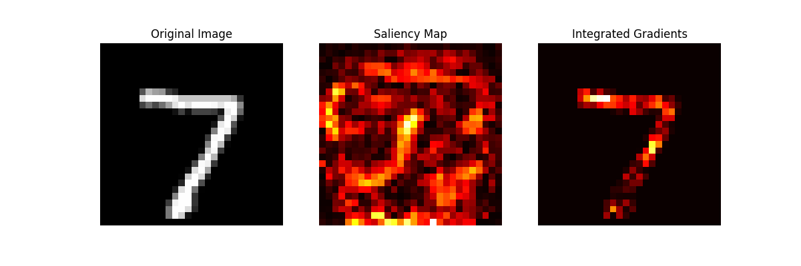

# My First PyTorch Classifier

This project is a simple deep learning classifier for the MNIST handwritten digit dataset, built with PyTorch.

## Projects
1.  `model.py`: Defines the neural network architecture and data loaders.
2.  `train.py`: The training script that trains the model and saves the weights to `my_first_classifier.pth`.
3.  `interpret.py`: An interpretability script to analyze the trained model using `captum`.

## Analysis of a "7"

I used two methods to analyze how the model identifies the digit "7":

1.  **Saliency:** This method was counterintuitive, highlighting only the "inside corners" of the digit. This seems to be an artifact of the method, finding the pixels at the decision boundary.
2.  **Integrated Gradients (IG):** This gave a much clearer result.

My analysis of the Integrated Gradients map:
* The most important pixels are at the **left of the horizontal bar**, which is likely the key feature the model uses to **differentiate a "7" from a "1"**.
* The model also focuses on the pixels just **after the top corner**, but the rest of the vertical line has low importance. This suggests the model has enough evidence after seeing the "corner+downstroke" and stops looking.
* The corner itself is only moderately important, as it's a feature shared with other digits (like "1").